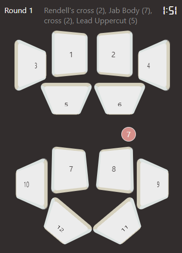

Welcome to Angelo Boxing Coach! ABC is a dynamic boxing pad workout app. Get a fresh workout anywhere, for the duration of your choosing, including combos you select!

# The app

Your boxing workout is literally one click away with ABC!

Whether you're left-handed or right-handed, no worries: ABC welcomes and seamlessly supports orthodox and southpaw enthusiasts. Hey, I'm a southpaw myself!

Just put on some good tunes, follow along the punches and actions, and get to sweating!

# Getting Started

in the "eric-richard-abc" folder, run "npm install" to install all dependencies

## Dependencies

These should include sass, axios and react-router-dom

## .env

The .env file should include the following variables:

REACT_APP_SERVER_URL="http://localhost:8080" (or current address of your eric-richard-abc-api server)

REACT_APP_DEFAULT_ROUND_DURATION=180

# Running ABC

Make sure the [ABC-API](https://github.com/ericjlrichard/eric-richard-abc) is running.

In a terminal console, run the command "npm start".